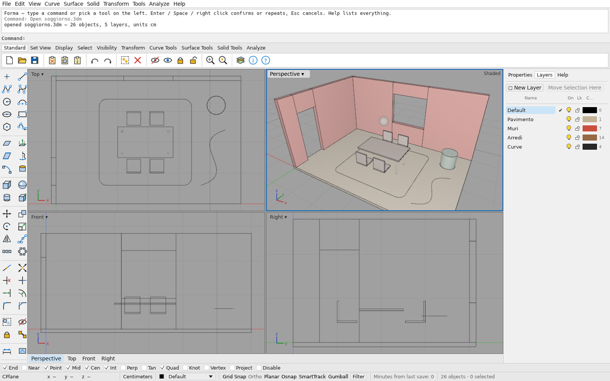
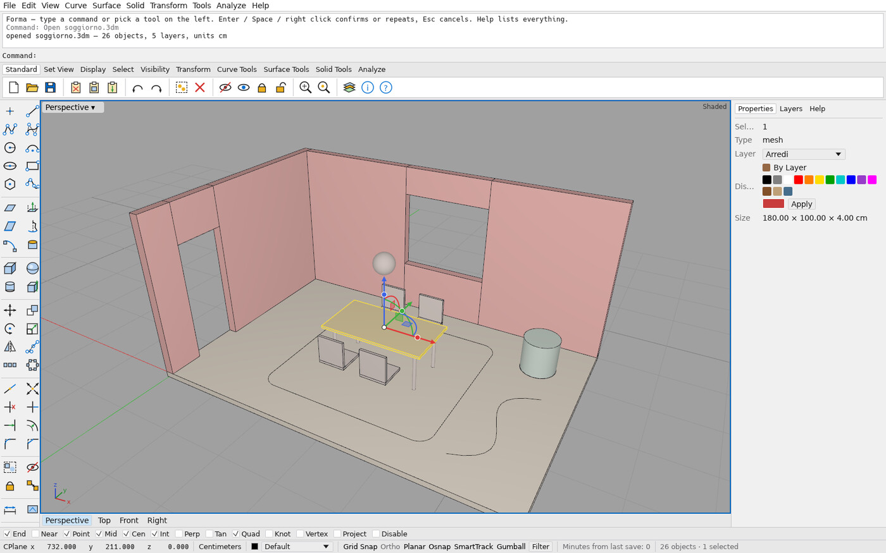
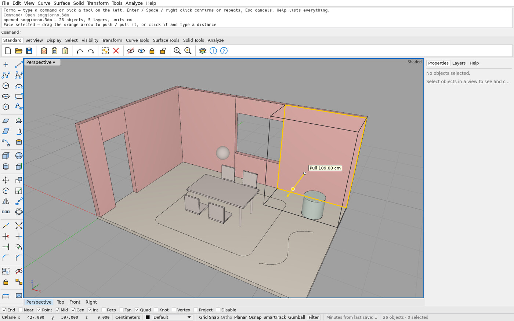
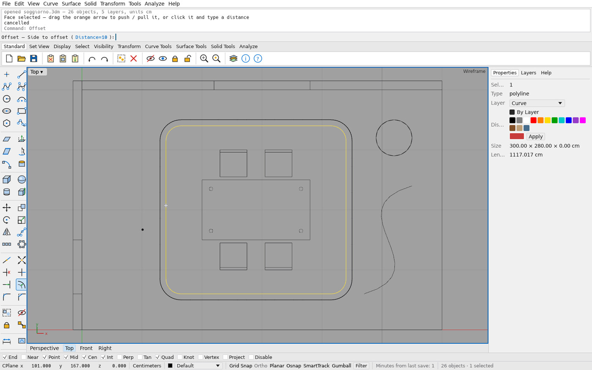
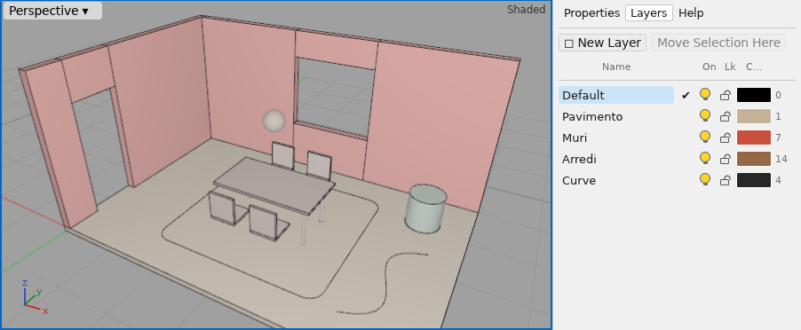

# Forma

**A personal, Rhino-style 3D modeller for interior design, written in Rust and built mostly by AI agents.**

[Download for Windows](https://github.com/filippovisentin/forma/releases/latest) ·
[Install](docs/INSTALL.md) · [Quick start](docs/QUICKSTART.md) · [Changelog](CHANGELOG.md) ·
[Roadmap](ROADMAP.md) · [In italiano](#in-italiano)



Forma is a desktop modeller that works the way Rhino users expect: a command line where
you type `Box` or `Polyline`, four viewports, object snaps, a gumball, layers and colours,
and `.3dm` files. I built it for my own interior-design work at the Politecnico di Milano,
and to find out whether AI coding agents can build a real CAD tool when a human acts as
architect and reviewer.

## Status: honest version

Forma **works**: you can draw a room in centimetres, extrude walls, push and pull faces,
arrange furniture, colour things by layer, and save a `.3dm` file. But it is young
(**v0.7.0**), and one thing matters before you rely on it:

> **Solids and surfaces are display meshes for now.** Box, Cylinder, Sphere, extrusions,
> Loft, Revolve, Sweep1 and PlanarSrf produce triangle meshes, not exact NURBS solids.
> Booleans (`BooleanUnion`, `BooleanDifference`, …), `FilletEdge`, `ChamferEdge` and `Shell`
> work on closed meshes through the OpenCascade kernel in the Windows build
> ([ADR 0001](docs/adr/0001-geometry-kernel.md)); exact NURBS surfaces come next.
> Curves are exact: lines, arcs, circles, polylines, polycurves and NURBS curves.

It is a personal project with one user (me). Expect rough edges, and keep backups of
files you care about.

## Screenshots

| | |
|---|---|
|  |  |
| **Gumball** on a selected object, Properties panel (layer, colour, size) | **Push / pull**: Ctrl+Shift+click a face, drag the orange arrow; the size updates live in cm |
|  |  |
| **Curve tools**: `Offset` preview with its clickable `Distance=10` option | **Layers** with colours, visibility and lock |

The room in these pictures is generated by [docs/examples/soggiorno.txt](docs/examples/soggiorno.txt).

## Download

1. Go to the [latest release](https://github.com/filippovisentin/forma/releases/latest) and
   download **`Forma-windows.zip`**.
2. Extract it anywhere (for example `Documents\Forma`) and double-click **`forma.exe`**.
   There is no installer.
3. Windows may say **"Windows protected your PC"** because the app is not code-signed.
   Click **More info → Run anyway**. This happens once.

Requirements: **Windows 10 or 11, 64-bit**, a graphics driver with DirectX 12 or Vulkan
(any reasonably recent PC). Step-by-step instructions, settings location and uninstalling:
[docs/INSTALL.md](docs/INSTALL.md).

There is no packaged macOS or Linux build. Forma does build and run on Linux from source
(that is where the agents develop and test it).

## Quick start

Open Forma and just start typing: keystrokes go to the command line.

```text
Rectangle 0,0 600,400        a 6 × 4 m room outline (new documents are in centimetres)
SelLast                      select it
Extrude 280                  a closed curve extrudes into a solid, 280 cm tall
Box 100,100 280,190 75       a 180 × 90 table block, 75 cm high
```

**Mouse**

| Action | What it does |
|---|---|
| Left click / drag right / drag left | select · window select · crossing select |
| Shift+click / Ctrl+click | add to / remove from the selection |
| Right drag | orbit (Perspective) · pan (Top, Front, Right) |
| Shift+right drag or middle drag | pan |
| Wheel | zoom at the cursor |
| Right click | Enter (repeat the last command) |
| Double-click a viewport title | maximize / back to four views |
| Ctrl+Shift+click a flat face | select the face for push / pull |

**Keys**: Enter or Space confirms · Esc cancels · Delete · Ctrl+Z / Ctrl+Y ·
Ctrl+C / X / V · Ctrl+G group · Ctrl+H hide · Ctrl+L lock · Ctrl+J join ·
F1 help · F3 properties · F7 grid · F8 Ortho · F9 grid snap.

**Command line**: an autocomplete list appears while you type (`pol` → Polygon, Polyline);
Up/Down on an empty line recall previous commands; options in brackets are clickable
(`Side to offset ( Distance=10 )`). Coordinates follow the usual conventions: `x,y`,
`x,y,z`, relative `@dx,dy[,dz]`, polar `@distance<angle`.

The [10-minute tutorial](docs/QUICKSTART.md) walks through a whole room.

## Features

About 90 commands, named like their Rhino counterparts where one exists, case-insensitive,
with short aliases (`L`, `PL`, `C`, `Rec`, `Ext`). `Help` (F1) lists them all inside the app.

| Category | Commands |
|---|---|
| Curves | `Point`, `Points`, `Line`, `Polyline`, `Curve`, `InterpCrv`, `Rectangle`, `Circle`, `Arc`, `Ellipse`, `Polygon` |
| Curve tools | `Offset`, `Trim`, `Split`, `Extend`, `Fillet`, `Chamfer`, `FilletCorners`, `Join`, `Explode`, `Flip`, `Intersect`, `ProjectToCPlane` |
| Surfaces *(meshes)* | `PlanarSrf` (with holes), `ExtrudeSrf`, `Loft`, `Revolve`, `Sweep1`, `Cap` |
| Solids *(meshes)* | `Box`, `Cylinder`, `Sphere`, `Extrude` / `ExtrudeCrv`, `MoveFace`, `PushPull` |
| Transform | `Move`, `Copy`, `Rotate`, `Scale`, `Scale1D`, `Scale2D`, `Mirror`, `Orient`, `Align`, `Array`, `ArrayLinear`, `ArrayPolar`, `Delete` |
| Selection | `SelAll`, `SelNone`, `Select`, `Invert`, `SelLast`, `SelCrv`, `SelMesh`, `SelPt`, `SelGroup` |
| Visibility & groups | `Hide`, `Show`, `Isolate`, `Lock`, `Unlock`, `Group`, `Ungroup` |
| Layers & colour | `Layer`, `ChangeLayer`, `LayerColor`, `LayerVisible`, `LayerLock`, `SetObjectColor`, `MatchProperties` |
| Analysis | `Distance`, `Length`, `Area`, `Volume`, `BoundingBox`, `What` |
| Files & clipboard | `New`, `Open`, `Save`, `Import`, `Export` (selected objects), `CopyToClipboard`, `Cut`, `Paste`, `Undo`, `Redo` |
| Views *(app)* | `Top`, `Front`, `Right`, `Perspective`, `ZE`, `ZEA`, `ZS`, `Wireframe`, `Shaded`, `Ghosted`, `XRay` |

**Modelling aids**: 11 object snaps (End, Near, Point, Mid, Cen, Int, Perp, Tan, Quad,
Knot, Vertex) plus Project and Disable; grid snap; Ortho; Planar; SmartTrack alignment
lines; live measurements next to the cursor (length and angle, width × height, radius,
push/pull distance) in document units.

**Gumball**: move along an axis or in a plane, rotate, type exact values; the dot on
each arrow extrudes curves and planar surfaces, or pushes/pulls the face of a solid.

**Interface**: menus, ten toolbar tabs, a sidebar, four viewports with per-view display
modes (Wireframe, Shaded, Ghosted, X-Ray), Properties / Layers / Help panels, recent
files, a "Save changes?" guard, and settings remembered between sessions.

**Not yet**: exact NURBS surfaces and solids, booleans, edge fillets, block instances,
text and dimensions, materials, OBJ/STL export, Record History. See the [roadmap](ROADMAP.md).

## File compatibility (`.3dm`)

Forma reads and writes Rhino `.3dm` files through **openNURBS**, McNeel's open-source
file library. It is a working exchange format, not yet a lossless round trip.

| | Opening (`Open`, `Import`) | Saving (`Save`, `Export`) |
|---|---|---|
| Units and tolerance | kept | written |
| Layers (nested `parent::child`, colour, visibility) | kept | written (layer lock is not) |
| Object colours | kept | written |
| Lines, arcs, circles, polylines, polycurves, NURBS curves | **converted to polylines** | written exactly |
| Points | kept | written |
| Breps, extrusions (Rhino solids and surfaces) | **converted to display meshes** | written as meshes |
| Meshes | kept | written |
| Block instances, text, dimensions, annotations | **skipped** | — |
| Materials, groups, hidden / locked state | not read | not written |

When you save a file that was opened from Rhino, Forma first proposes a new name
(`name-forma.3dm`) so the original is not overwritten with meshes.

`forma-cli info model.3dm` prints a summary of any `.3dm` file (units, layers, object
types, blocks) without opening the app.

## Build from source

You need:

- **Rust** (stable, via [rustup](https://rustup.rs))
- a **C++ toolchain** and **CMake**: on Windows the *Visual Studio Build Tools* with
  "Desktop development with C++", on Linux `g++` or `clang` plus `cmake`
- **git**, for the openNURBS submodule

```sh
git clone https://github.com/filippovisentin/forma
cd forma
git submodule update --init --depth 1        # openNURBS (third_party/opennurbs)
cargo run -p forma --release                 # the desktop app
cargo run -p forma --release -- model.3dm    # ... opening a file
```

The first build compiles openNURBS (about 250 C/C++ files) and takes a couple of minutes.

The headless CLI runs the same engine as the app:

```sh
cargo run -p forma-cli -- commands                                   # every command with its syntax
cargo run -p forma-cli -- run --script "Box 0,0 200,100 80" --dump   # run commands, print the document
cargo run -p forma-cli -- run --file docs/examples/soggiorno.txt     # build the sample room
cargo run -p forma-cli -- info model.3dm                             # summary of a .3dm file
cargo run -p forma-cli -- render model.3dm view.png --view perspective
cargo xtask ci                                                       # fmt, clippy, tests, layering
```

## Project structure

Crates are layered: each may depend only on lower layers, and `cargo xtask layering`
enforces it. Details in [ARCHITECTURE.md](ARCHITECTURE.md).

| Path | Role |
|---|---|
| `crates/geom` | Geometry: points, planes, transforms, curves, NURBS, mesh solids, tolerances |
| `crates/doc` | The document: objects, layers, attributes, undo/redo |
| `crates/io-3dm` | `.3dm` read/write through openNURBS (C++ via a small C shim) |
| `crates/render` | wgpu renderer: viewports, display modes, offscreen screenshots |
| `crates/engine` | Command registry, command-line parser, every modelling command |
| `crates/ui` | egui interface: viewports, command line, gumball, snaps, panels |
| `crates/io-mesh`, `crates/mcp` | OBJ/STL/glTF export and the MCP server for agents (planned) |
| `apps/forma`, `apps/forma-cli` | Desktop app and headless CLI |
| `xtask` | CI gate and layering check |
| `docs/adr` | Architecture decision records |
| `third_party/opennurbs` | openNURBS submodule |

**Everything is a command**: menus, toolbar buttons, the gumball, the command line and
scripts all go through `forma-engine`, so whatever the app can do, a script or an agent
can do too.

## How Forma is built

Almost all the code is written by AI coding agents (Claude Code); I act as architect,
reviewer and only user. The agents follow the rules in [CLAUDE.md](CLAUDE.md): every
action is a command, the crate layering is enforced, every command ships with tests,
new dependencies need a decision record in [docs/adr](docs/adr), tolerances are explicit,
and nothing is done until `cargo xtask ci` is green on Linux and Windows. Several agents
work in parallel on separate branches (for example, one on Rhino command parity and one
on the OpenCascade kernel). Contributions and issues are welcome: see
[CONTRIBUTING.md](CONTRIBUTING.md).

**Clean-room**: Rhino is used only as a behavioural reference (how commands behave and
what they prompt for). No McNeel code, documentation text, icons or UI assets are copied.
Forma's icons are drawn in code. openNURBS is used as a library under its own licence.

## Roadmap

Next: the OpenCascade kernel for exact solids, booleans and fillets (M4), a full `.3dm`
round trip with blocks and materials (M5), and an MCP server so agents can model through
Forma (M6). Full plan and status: [ROADMAP.md](ROADMAP.md).

## Licence

Forma is dual-licensed under **MIT** ([LICENSE-MIT](LICENSE-MIT)) **or Apache-2.0**
([LICENSE-APACHE](LICENSE-APACHE)), at your option. Copyright © 2026 Filippo Antonio Visentin.

Third-party code keeps its own licence; see [ATTRIBUTION.md](ATTRIBUTION.md). In
particular, openNURBS (© Robert McNeel & Associates, with bundled zlib and FreeType) is
distributed under its own permissive licence. OpenCascade (LGPL-2.1 with the Open CASCADE
exception) is used only by the kernel spike today and is not part of the released app.

## Acknowledgements

- [openNURBS](https://github.com/mcneel/opennurbs) by Robert McNeel & Associates, which
  makes `.3dm` exchange possible
- [egui / eframe](https://github.com/emilk/egui), [wgpu](https://wgpu.rs),
  [spade](https://github.com/Stoeoef/spade), [rfd](https://github.com/PolyMeilex/rfd) and
  the rest of the Rust ecosystem
- [Open CASCADE Technology](https://dev.opencascade.org), the kernel Forma is moving to
- Rhino, whose way of working is the reference for how Forma should feel

## Disclaimer

Forma is an independent personal project. It is **not affiliated with, endorsed by or
sponsored by Robert McNeel & Associates**. Rhino and Rhinoceros are registered trademarks
of Robert McNeel & Associates; they are mentioned only to describe compatibility and
behaviour. The software is provided "as is", without warranty of any kind (see the
licences). It is not a substitute for professional CAD software in production work.

---

## In italiano

**Forma** è un modellatore 3D personale in stile Rhino, pensato per l'interior design,
scritto in Rust e costruito quasi interamente da agenti AI, con me (Filippo Antonio
Visentin, studente di Interior Design al Politecnico di Milano) come architetto,
revisore e unico utente.

**Stato.** Funziona: si disegna una stanza in centimetri, si estrudono i muri, si
spingono e tirano le facce, si organizzano layer e colori e si salva in `.3dm`. È però
giovane (v0.7.0): **solidi e superfici sono per ora mesh di visualizzazione**, non solidi
NURBS esatti. Booleane, `FilletEdge`, `ChamferEdge` e `Shell` funzionano già sulle mesh
chiuse grazie al kernel OpenCascade (versione Windows); le superfici NURBS esatte arriveranno
dopo. Le curve invece sono esatte.

**Download.** Dalla [pagina dell'ultima release](https://github.com/filippovisentin/forma/releases/latest)
scarica `Forma-windows.zip`, estrai la cartella e fai doppio clic su `forma.exe` (Windows
10/11 a 64 bit, nessuna installazione). Se compare "PC protetto da Windows": **Ulteriori
informazioni → Esegui comunque** (l'app non è firmata). Istruzioni complete:
[docs/INSTALL.it.md](docs/INSTALL.it.md). Primo tutorial di 10 minuti:
[docs/QUICKSTART.it.md](docs/QUICKSTART.it.md).

**Come si usa.** Scrivi direttamente i comandi (`Rectangle`, `Box`, `Extrude`, `Offset`…),
con autocompletamento e storico; mouse destro per ruotare o spostare la vista, rotella per
lo zoom, clic destro = Invio; Ctrl+Maiusc+clic su una faccia per il push/pull. Circa 90
comandi (vedi la tabella *Features* sopra), 11 osnap, SmartTrack, gumball, misure in
tempo reale.

**File `.3dm`.** Lettura e scrittura tramite openNURBS. All'apertura curve → polilinee e
solidi/superfici Rhino → mesh; blocchi, testi e quote vengono saltati. Al salvataggio le
curve sono esatte e solidi/superfici diventano mesh; layer annidati, colori e unità si
conservano. Se salvi un file aperto da Rhino, Forma propone un nuovo nome (`nome-forma.3dm`).

**Compilare.** Rust stabile, un compilatore C++ e CMake, poi
`git submodule update --init --depth 1` e `cargo run -p forma --release`.

**Licenza.** MIT oppure Apache-2.0, a scelta. Le librerie di terze parti (openNURBS
compresa) mantengono le proprie licenze, vedi [ATTRIBUTION.md](ATTRIBUTION.md).

**Avvertenza.** Progetto indipendente, **non affiliato a Robert McNeel & Associates**.
Rhino e Rhinoceros sono marchi registrati di Robert McNeel & Associates. Software fornito
"così com'è", senza garanzie.
